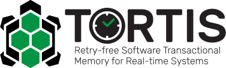

# TORTIS

    
    
    
    

TORTIS is an extension of [Rust] that adds functionality for real-time software transactional memory without retries. TORTIS extends the Rust compiler to recognize the “transaction” key word, and provides automatic synchronization of shared objects within transactions.  To do so, it extends the Rust type system to include TxPointer and TxCell types, which wrap shared objects. An additional pass is added to the compiler to determine what shared objects are used within a transaction, and emit calls to the runtime locking library that TORTIS provides. The runtime library is modular and supports many different synchronization primitives. Currently, a phase-fair reader-writer lock is used.  

[Rust]: https://www.rust-lang.org

To get started using TORTIS, see our [Getting Started Guide](GettingStarted).
Because TORTIS is an extension of the Rust compiler, also reference the [Rust
README](RustREADME). For additional TORTIS documentation see our
[Documentation](Documentation).

## Contributing

To contribute to TORTIS, please see [CONTRIBUTING](CONTRIBUTING.md).

## Disclaimer

Tortis is distributed under the terms of the MIT License
DISTRIBUTION STATEMENT A. Approved for public release: distribution unlimited.

© 2021 MASSACHUSETTS INSTITUTE OF TECHNOLOGY

    Subject to FAR 52.227-11 – Patent Rights – Ownership by the Contractor (May 2014)
    SPDX-License-Identifier: MIT

This material is based upon work supported by the Under Secretary of Defense (USD) for Research & Engineering (R&E) under Air Force Contract No. FA8702-15-D-0001. Any opinions, findings, conclusions or recommendations expressed in this material are those of the author(s) and do not necessarily reflect the views of USD (R&E).

The software/firmware is provided to you on an As-Is basis

## Trademark

The Rust programming language is an open source, community project governed
by a core team. It is also sponsored by the Mozilla Foundation (“Mozilla”),
which owns and protects the Rust and Cargo trademarks and logos
(the “Rust Trademarks”).

If you want to use these names or brands, please read the [media guide][media-guide].

Third-party logos may be subject to third-party copyrights and trademarks. See
[Licenses][policies-licenses] for details.

[media-guide]: https://www.rust-lang.org/policies/media-guide
[policies-licenses]: https://www.rust-lang.org/policies/licenses
